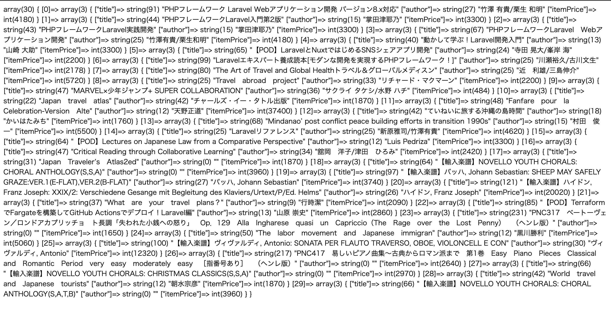

# 楽天api叩いて、表示まで

**必要なこと**
- 楽天IDの取得（個人で取得した）
やり方
https://webservice.rakuten.co.jp/app/create

- composer.jsonにrakuten sdkの追加
やり方
https://qiita.com/shin_moto/items/7d0e404070850d13def1

- .envファイルに取得した楽天IDの登録
RAKUTEN_APPLICATION_ID=(アプリIDを書いてね)
RAKUTEN_APPLICATION_SEACRET=(application_secretを書いてね、今回は使わないよ)

**やること**
- title使って楽天apiに投げる
- 返ってきたパラメータをビューに投げる
- 表示する

**手順**
- php artisan make:controller コントローラ名 --resource でコントローラ作成
  - --resource : あるデータの追加、読み取り、更新、削除についての決まり切った処理を簡潔にできる機能
- routes/web.phpでroute設定. useでコントローラをインポート
- コントローラindex関数のreturnでビューのindexを指定。(views/index.blade.phpを作成)

**完成画像**
